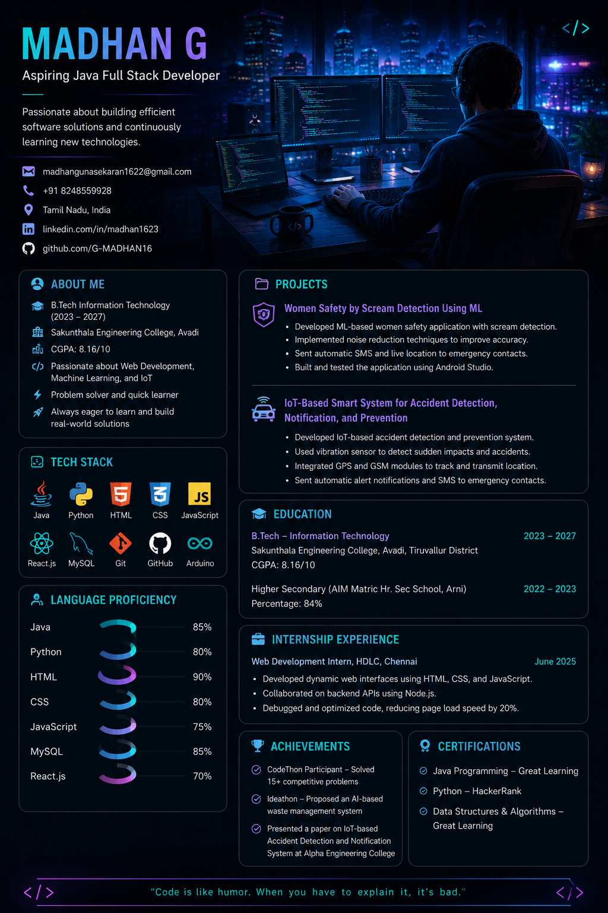

  

# MADHAN G

### Aspiring Java Full Stack Developer

*Passionate about building efficient software solutions and continuously learning new technologies.*

📧 madhangunasekaran1622@gmail.com • 📞 +91 8248559528  
💼 linkedin.com/in/madhan1623 • 🐙 github.com/G-MADHAN16

---

## 👨‍💻 ABOUT ME

🎓 B.Tech Information Technology (2023 – 2027)  
🏫 Vel Tech High Tech Dr. Rangarajan Dr. Sakunthala Engineering College  
📊 CGPA: 8.16 / 10  
💡 Passionate about Web Development, Machine Learning, and IoT  
⚡ Problem solver and quick learner  
🚀 Always eager to learn and build real-world solutions

---

## 🛠️ TECH STACK

---

## 📈 LANGUAGE PROFICIENCY

| Technology | Level |
|------------|--------|
| Java | 🔵🔵🔵🔵⚪ |
| Python | 🔵🔵🔵🔵⚪ |
| HTML | 🔵🔵🔵🔵🔵 |
| CSS | 🔵🔵🔵🔵⚪ |
| JavaScript | 🔵🔵🔵⚪⚪ |
| MySQL | 🔵🔵🔵🔵⚪ |
| React.js | 🔵🔵🔵⚪⚪ |

---

## 📂 PROJECTS

### 🚨 Women Safety by Scream Detection Using ML

- Developed ML-based women safety application with scream detection.
- Implemented noise reduction techniques to improve accuracy.
- Sent automatic SMS and live location to emergency contacts.
- Built and tested using Android Studio.

### 🚗 IoT-Based Accident Detection, Notification and Prevention

- Developed IoT-based accident detection system.
- Used vibration sensor to detect sudden impacts.
- Integrated GPS and GSM modules.
- Sent automatic SMS notifications to emergency contacts.

---

## 🎓 EDUCATION

| Degree | Institution | Year |
|---------|------------|------|
| B.Tech Information Technology | Vel Tech High Tech | 2023–2027 |
| Higher Secondary | AIM Matric Hr. Sec School | 2022–2023 |

---

## 💼 INTERNSHIP EXPERIENCE

### Web Development Intern | HDLC, Chennai

- Developed dynamic web interfaces using HTML, CSS and JavaScript.
- Collaborated on backend APIs using Node.js.
- Debugged and optimized code reducing page load speed.

---

## 🏆 ACHIEVEMENTS

- ✅ CodeThon Participant – Solved 15+ coding problems
- ✅ Ideathon – Proposed AI-based waste management system
- ✅ Presented IoT research paper at Alpha Engineering College

---

## 📜 CERTIFICATIONS

- Java Programming – Great Learning
- Python – HackerRank
- Data Structures & Algorithms – Great Learning

---

## 📊 GITHUB STATS

---

> *"Code is like humor. When you have to explain it, it's bad."*

